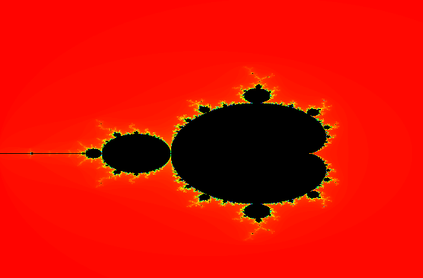

# Mandelbrot Set Viewer

## About

This is a program that calculates the mandelbrot set and visualizes its fractals

## Controls

- ->: pan right
- <-: pan left
- ^: pan up
- v: pan down
- scroll wheel: zoom in/out

